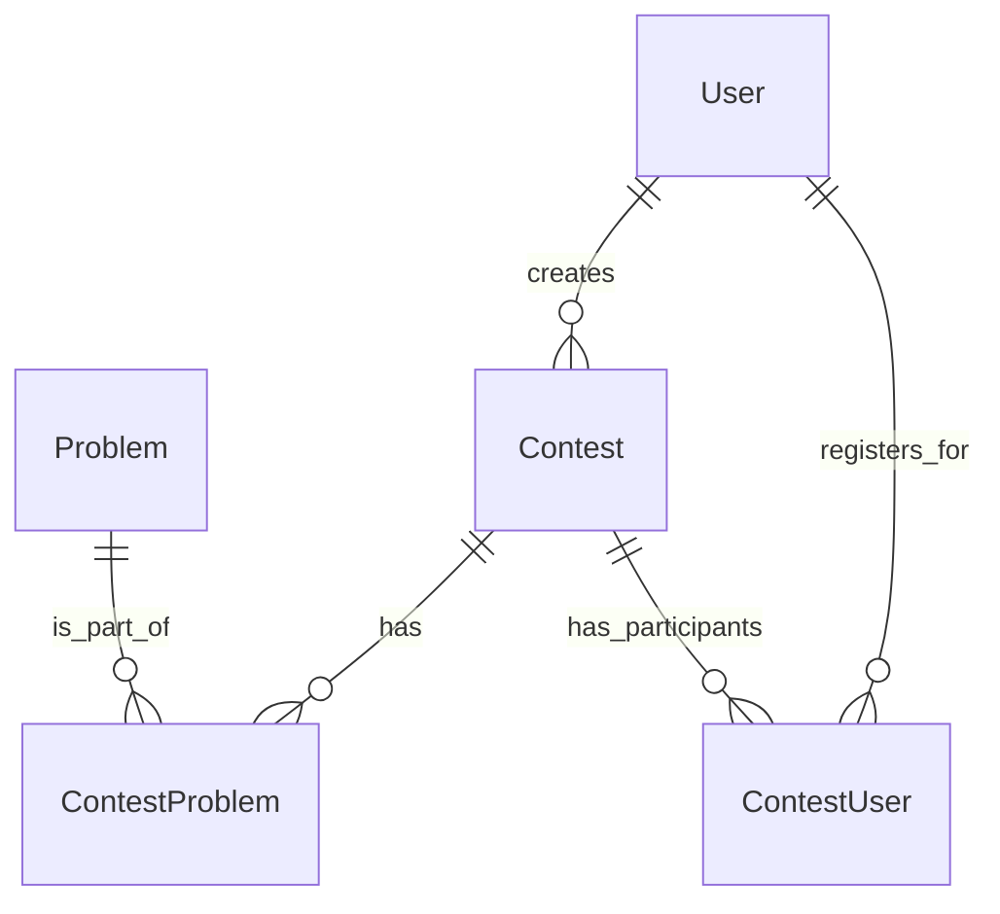

# Contest Feature Design for Tensara

This document outlines the database schema and API design for the new "contests" feature in Tensara, addressing the specified requirements for problem management and visibility.

## 1. Database Schema Design (Prisma Models)

The following Prisma models will be added or modified to support the contest feature.

### `Contest` Model

Represents a programming contest. No changes are needed for this model.

```prisma
model Contest {
  id          String        @id @default(cuid())
  title       String
  description String?
  startTime   DateTime
  endTime     DateTime
  status      ContestStatus @default(UPCOMING) // upcoming, active, finished, archived
  creatorId   String
  creator     User          @relation("Creator", fields: [creatorId], references: [id])

  problems    ContestProblem[] // Link to problems in this contest
  participants ContestUser[]    // Link to users registered for this contest

  createdAt   DateTime      @default(now())
  updatedAt   DateTime      @updatedAt
}

enum ContestStatus {
  UPCOMING
  ACTIVE
  FINISHED
  ARCHIVED // Problems can be made public after contest ends
}
```

### `Problem` Model

A new `visibility` field will be added to the `Problem` model to control whether it is `PUBLIC` or `PRIVATE`. This will allow admins to manage problem visibility within a contest.

```prisma
model Problem {
  id          String    @id @default(cuid())
  title       String
  description String
  // ... other problem fields

  visibility  ProblemVisibility @default(PUBLIC)
  contests    ContestProblem[]
}

enum ProblemVisibility {
  PUBLIC
  PRIVATE
}
```

### `ContestProblem` Model

This model links a problem to a contest. The `isPublic` field is removed, as visibility is now handled by the `Problem` model's `visibility` field.

```prisma
model ContestProblem {
  id        String  @id @default(cuid())
  contestId String
  problemId String

  contest Contest @relation(fields: [contestId], references: [id])
  problem Problem @relation(fields: [problemId], references: [id])

  @@unique([contestId, problemId])
}
```

### `ContestUser` Model

Manages user registration for contests. No changes are needed for this model.

```prisma
model ContestUser {
  id        String   @id @default(cuid())
  contestId String
  userId    String
  registeredAt DateTime @default(now())

  contest Contest @relation(fields: [contestId], references: [id])
  user    User    @relation("Participant", fields: [userId], references: [id])

  @@unique([contestId, userId]) // Ensures a user registers for a contest only once
}
```

### Relationships Overview



## 2. API Endpoint Design (tRPC Router)

The API will be updated to support the new problem management features.

### `contestRouter` Updates

The `contestRouter` will be modified to include procedures for adding and removing problems from a contest. These actions are restricted to administrators.

```typescript
// src/server/api/routers/contests.ts

export const contestRouter = createTRPCRouter({
  // ... existing procedures

  addProblemToContest: adminProcedure
    .input(z.object({
      contestId: z.string(),
      problemId: z.string(),
    }))
    .mutation(async ({ ctx, input }) => {
      // Creates a ContestProblem entry to link an existing problem to a contest.
      // This is an admin-only action.
      // The problem must exist in the database.
    }),

  removeProblemFromContest: adminProcedure
    .input(z.object({
      contestId: z.string(),
      problemId: z.string(),
    }))
    .mutation(async ({ ctx, input }) => {
      // Deletes a ContestProblem entry to unlink a problem from a contest.
      // This is an admin-only action.
    }),
});
```

### New `problemsRouter`

A new `problemsRouter` will be created to handle problem-specific actions, such as updating visibility.

```typescript
// src/server/api/routers/problems.ts

import { z } from "zod";
import { createTRPCRouter, adminProcedure } from "../trpc";
import { ProblemVisibility } from "@prisma/client";

export const problemsRouter = createTRPCRouter({
  updateProblemVisibility: adminProcedure
    .input(z.object({
      problemId: z.string(),
      visibility: z.nativeEnum(ProblemVisibility),
    }))
    .mutation(async ({ ctx, input }) => {
      // Updates the visibility of a problem to PUBLIC or PRIVATE.
      // This is an admin-only action.
    }),
});
```

## 3. UI/UX Design

A new "Manage Problems" section will be added to the contest details page (`/contests/[id]`), visible only to administrators.

### Admin Problem Management Panel

-   **Display:** Shows a list of all problems currently associated with the contest, including their title and current visibility status (`PUBLIC` or `PRIVATE`).
-   **Add Problem:** A search input with autocomplete allows admins to find existing problems in the database by title and add them to the contest. Clicking "Add" will trigger the `contestRouter.addProblemToContest` mutation.
-   **Remove Problem:** Each problem in the list has a "Remove" button, which triggers the `contestRouter.removeProblemFromContest` mutation.
-   **Toggle Visibility:** Each problem has a toggle switch to change its status between `PUBLIC` and `PRIVATE`. This directly calls the `problemsRouter.updateProblemVisibility` mutation.

### Admin Workflow

This diagram illustrates the workflow for an admin managing problems in a contest.

```mermaid
graph TD
    A[Admin navigates to Contest Details Page] --> B{Is Admin?};
    B -- Yes --> C[Show "Manage Problems" Panel];
    B -- No --> D[Hide Panel];
    C --> E[View Contest Problems];
    C --> F[Add Problem];
    C --> G[Remove Problem];
    C --> H[Toggle Visibility];

    F -- Search & Select --> I[Call addProblemToContest];
    G -- Click Remove --> J[Call removeProblemFromContest];
    H -- Toggle Switch --> K[Call updateProblemVisibility];

    I --> E;
    J --> E;
    K --> E;
```